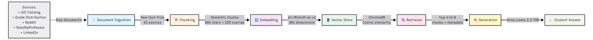

# Project 1 Planning: The Unofficial Guide

## Domain

<!-- What domain did you choose? Why is this knowledge valuable and hard to find through official channels? -->

I have chosen Data Science Courses for UIC DS students since it's a relatively new program in the CS department. Because of this, I would like to help UIC DS students find courses that are manageable, genuinely interesting, and well-taught, which support workload balance and mental wellness, not just degree completion. 

---

## Documents

<!-- List your specific sources: URLs, subreddit names, forum threads, or file descriptions.
     Aim for at least 10 sources that together cover different subtopics or perspectives within your domain. -->

| # | Source | Description | URL or location |
|---|--------|-------------|-----------------|
| 1 | Rate my professor| Blog | https://www.ratemyprofessors.com/school/1111|
| 2 | Reddit |Blog  |https://www.reddit.com/r/uichicago/ |
| 3 | UIC catalog |School website | https://www.reddit.com/r/uichicago/|
| 4 | UIC grade distribution | School website | https://uicgrades.com/ |
| 5 | UIC Data Science Major Info Page| School website| https://cs.uic.edu/undergraduate/data-science-major/ |
| 6 | Coursicle | Blog | https://www.coursicle.com/uic/|
| 7 | LinkedIn UIC| Blog |https://www.linkedin.com/school/thisisuic/posts/?feedView=all |
| 8 | Medium | Blog | https://medium.com/search?q=uic|
| 9 | Student Orgs |School website | https://cs.uic.edu/undergraduate      student-organizations/|
| 10 | ULoop |Blog |https://illinois.uloop.com/professors |

---

## Chunking Strategy

<!-- How will you split documents into chunks?
     State your chunk size (in tokens or characters), overlap size, and explain why those
     numbers fit the structure of your documents.
     A review-heavy corpus warrants different chunking than a long FAQ. -->

### Chunk Size
- **Size:** 800 characters
- **Justification:** Course catalogs typically 8–15K chars each. 
  800-char chunks preserve semantic units (prerequisites, grading 
  policies) without splitting mid-concept.

### Chunk Overlap
- **Size:** 200 characters (25% of chunk size)
- **Justification:** Prevents fragmentation at chunk boundaries. 
  Ensures policies/requirements that span the boundary appear complete 
  in overlapping chunks.

### Preprocessing
- **Steps:**
  1. Strip HTML tags
  2. Remove navigation/boilerplate
  3. Normalize whitespace
- **Why:** Cleaner text → higher-quality embeddings

### Final Chunk Count
- **Total:** [Run pipeline to determine; estimated 80–150]
- **Per source:** ~10–15 chunks (varies by source size)
- **Measurement:** `len(all_chunks)` after processing all 10 sources

---

## Retrieval Approach

<!-- Which embedding model are you using (e.g., all-MiniLM-L6-v2 via sentence-transformers)?
     How many chunks will you retrieve per query (top-k)?
     If you were deploying this for real users and cost wasn't a constraint, what tradeoffs
     would you weigh in choosing a different embedding model — context length, multilingual
     support, accuracy on domain-specific text, latency? -->

**Embedding model:**
- all-MiniLM-L6-v2 (384 dimensions)
**Top-k:**
- 5–8 results per query
**Production tradeoff reflection:**
There are other models that do have fast speeds and are high quality, for example: Open AI's text embedding model 3-small would be great since its setup is simple and is great for general uses, or cohere embed-english v3.0 for production RAG systems, like this one specifically. However, they are not free. 

## Evaluation Plan

<!-- List your 5 test questions with their expected correct answers.
     Questions should be specific enough that you can judge whether the system's response
     is right or wrong. "What are good dining halls?" is too vague.
     "What do students say about wait times at [dining hall name] during lunch?" is testable. -->

| # | Question | Expected answer |
|---|----------|-----------------|
| 1 |What are the prereqs for CS251? | UIC Catalog chunk with full prereq list|
| 2 | Who teaches CS251?| Professors names |
| 3 | Is Professor Hallenback known for being generous with grading?| RMP reviews mentioning grading |
| 4 | What skills will I learn in IDS 435? | Course description |
| 5 | What do current students say about workload in CS480 or Cs 342?| Multiple Reddit/ RMP reviews synthesized |

---

## Anticipated Challenges

<!-- What could go wrong? Name at least two specific risks with reasoning.
     Consider: noisy or inconsistent documents, missing source attribution, off-topic
     retrieval, chunks that split key information across boundaries. -->

1. Because half of my sources are unstructured, and come from places like Reddit, Rate My Professor, or LinkedIn, I can expect that they're going to be high-noise and inconsistent. This is because experiences are subjective, and can strongly differ by person. Because there is no guarantee on a consensus, there could be retrieval failure.

2. For the other half of my sources that are strutured- the UIC catalogs, Grade Distribution, and Info Pages, there can be some inconsitency still present. This is because a catalog can list some course's prereqs, then the grade distribution course can say that most students took only one of those listed courses, and the info page can say that students must take only one mentioned prereq. Also, some websites might not be as updated and retrieve completely wrong information. Also, the output could be varied depending on the wording of the question. 

---

## Architecture

---

## AI Tool Plan

<!-- For each part of the pipeline below, describe:
     - Which AI tool you plan to use (Claude, Copilot, ChatGPT, etc.)
     - What you'll give it as input (which sections of this planning.md, which requirements)
     - What you expect it to produce
     - How you'll verify the output matches your spec

     "I'll use AI to help me code" is not a plan.
     "I'll give Claude my Chunking Strategy section and ask it to implement chunk_text()
     with my specified chunk size and overlap" is a plan. -->

**Milestone 3 — Ingestion and chunking:**

**Milestone 4 — Embedding and retrieval:**

**Milestone 5 — Generation and interface:**
